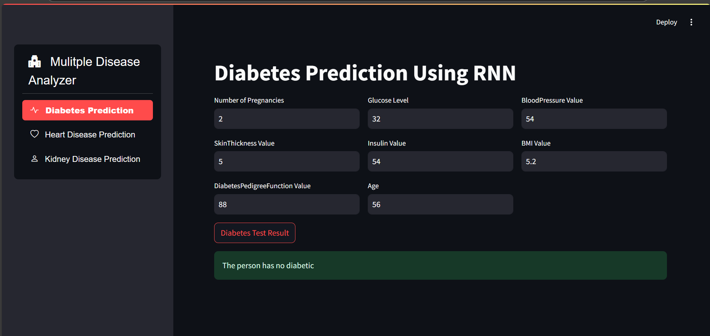

# 🩺 Multiple Disease Analyzer

## 🌟 Overview

The **Multiple Disease Analyzer** is a Python-based machine learning project designed to analyze and predict various diseases based on input data. This tool leverages **machine learning** and **deep learning** models with an interactive web application using **Streamlit**.



---


## ✨ Features

✔️ **Interactive Web Interface** using Streamlit  
✔️ **Machine Learning Models** for accurate predictions  
✔️ **Data Visualization** with Plotly  
✔️ Handles multiple diseases in one framework  
✔️ Easy-to-use and scalable  

---

## 🔧 Technologies Used

- 🐍 **Python**: Core programming language
- 🧠 **Machine Learning**: Using TensorFlow, scikit-learn, and other libraries
- 📊 **Data Handling**: pandas, numpy
- 📈 **Data Visualization**: Plotly
- 🌐 **Web App Framework**: Streamlit
- 📘 **Jupyter Notebook**: For development and experimentation

---

## 🛠️ Prerequisites

Ensure you have the following installed:

- Python 3.x
- Required libraries:
  ```bash
- To Run
    ```bash
      py -m streamlit run app.py
